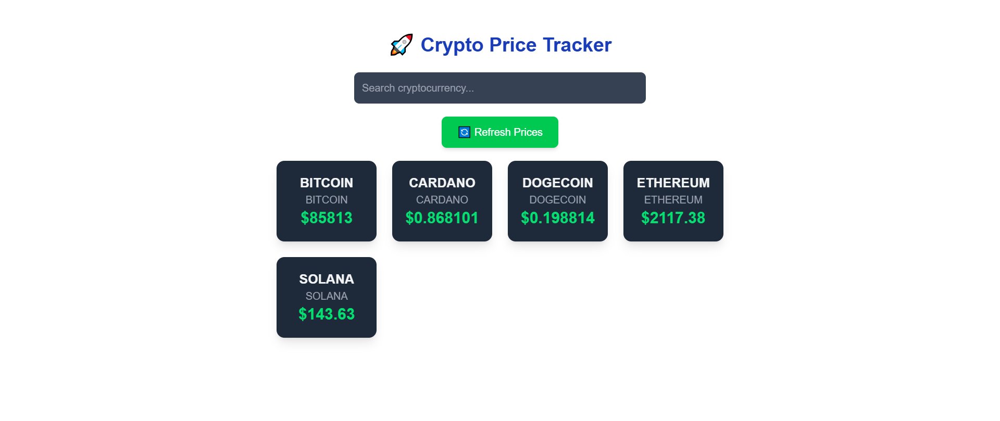

# Crypto Price Tracker Documentation 🚀

## 📌 Introduction  
This project is a **simple crypto price tracker** built with **Next.js**.  
It fetches live cryptocurrency prices from **CoinGecko API** and displays them in a user-friendly dashboard.

## 📡 API Integration  
We use CoinGecko API to fetch live crypto prices. The API request URL is:  ``https://api.coingecko.com/api/v3/simple/price?ids=bitcoin,ethereum,cardano,solana,dogecoin&vs_currencies=usd``

in this simple app i use `fetch` to simplify the task but i can use `axios` or `Rtk query` 

To handle API requests efficiently, we use **Redux Toolkit** for state Managment.

here i also can use `contextApi` 

## 🔄 State Management  
We chose **Redux Toolkit** because:  
✅ It automatically refreshes data when needed.  
✅ Efficient State Management: Redux Toolkit helps manage global state efficiently, making it easier to share data across components.
✅ Performance Optimization: It minimizes unnecessary API calls by caching the fetched data and reusing it until an update is required.
## Styling 
  🎨tailwind.css
## 🚀 Project Setup  
### 1️⃣ Clone the Repository  
```sh
install node.js
git clone https://github.com/your-username/crypto-tracker.git
cd crypto-tracker
```
## how to start

  `npx create-next-app@latest web-app-prices`

 `cd web-app-prices directory`

 `run    npm run dev `
 
 `open your favourite browser and enjoy  [http://localhost:3000] `
## Challenges & solutions
  ### how to manage the states 

  i solve this problem by using redux toolkit 

